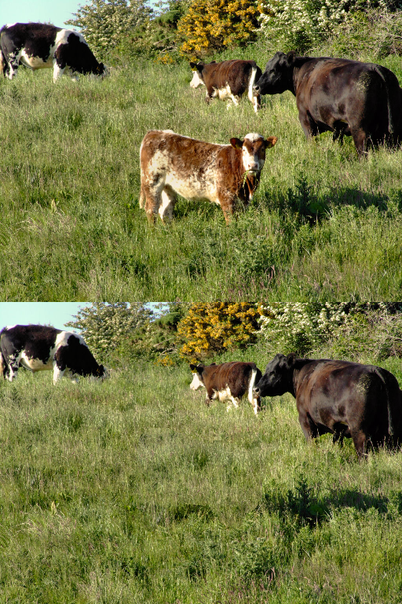

The source code is written by Petter Strandmark and may be freely distributed.

This inpainting tool uses Coherency Sensitive Hashing.
You can download a Matlab toolbox at http://www.eng.tau.ac.il/~simonk/CSH/index.html

The "cow" image appears at http://www.irishviews.com/cows.html where it is listed as free for personal use.

